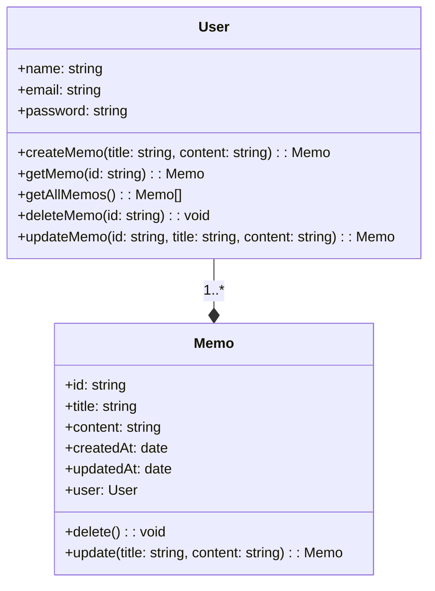
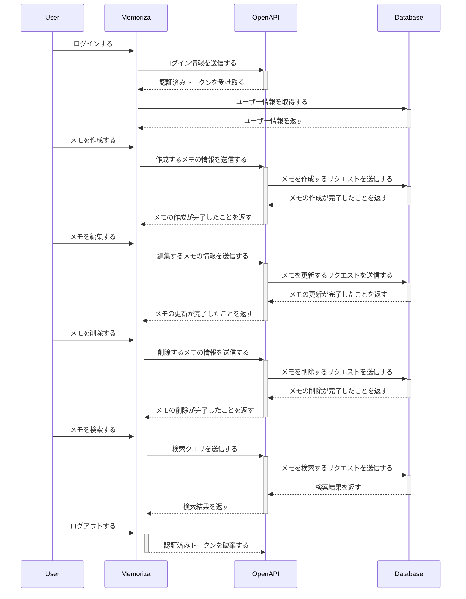

# Memoriza

## メモスキルを上げる

URL: https://chat.openai.com/chat/22f18164-12ae-481e-a508-5c211e0ffd82

## メモスキルを上げる...

メモスキルを上げるメモ術を知っていますか？

### 💬 Answer

はい、メモスキルを上げるための効果的なメモ術をいくつか紹介します。

1. マインドマップを使う：マインドマップは、アイデアを整理するための非常に効果的なツールです。一般的なリスト形式よりも、より脳に近い構造を持ち、アイデアをより効果的に組織化できます。
2. カラーコーディングを使用する：カラーコーディングを使用すると、情報を簡単に特定できます。たとえば、緑色は重要な情報、青色はアイデア、赤色はタスクなどに割り当てることができます。
3. 簡潔な言葉を使う：メモは簡潔である必要があります。短く、簡潔にまとめることで、情報をすばやく理解できるようになります。また、略語を使用することもできます。
4. 重要な情報をハイライトする：ハイライトを使用することで、重要な情報を強調することができます。重要な情報を見つけやすくなり、後で見返したときにすばやく理解できます。
5. レビューする：メモを書いたら、定期的にレビューして情報を復習することをお勧めします。この方法は、長期的な記憶を改善し、情報を継続的に使うことができます。

これらのテクニックを実践することで、メモスキルを向上させることができます。

## 教えてくれたメモ術...

教えてくれたメモ術をwebアプリにするとしたらどのようなアイデアがありますか？

### 💬 Answer

いくつかのアイデアを提供します。

1. マインドマップツール：マインドマップを作成し、カラーコーディングを行うためのシンプルなウェブアプリ。ユーザーは、ドラッグアンドドロップで要素を追加し、色やアイコンを割り当てることができます。
2. フラッシュカードジェネレーター：フラッシュカードを作成するためのウェブアプリ。ユーザーは、単語や定義を入力し、簡単なクイズを作成することができます。また、カードをカスタマイズするために、イメージやサウンドを追加することもできます。
3. レビューアプリ：ユーザーが定期的にレビューすることを支援するアプリ。ユーザーは、メモやタスクを作成し、特定の頻度で通知を受け取ります。アプリは、次にレビューする項目を選択し、すでにレビューした項目を再度提示することにより、情報を定着させます。
4. カラーコーディングツール：情報を簡単に特定するためのカラーコーディングツール。ユーザーは、特定の色を割り当てて、情報を分類することができます。このアプリは、プロジェクトマネジメントやカレンダーアプリなど、様々なアプリケーションで使用できます。

これらのアイデアを活用して、メモスキルを改善するための有用なウェブアプリを開発することができます。

## 3と4のアイデアを...

3と4のアイデアを組み合わせると良いアプリになりそうな気がします。そうしたアプリを作るとしたら、どうしたら良いですか？

### 💬 Answer

3と4のアイデアを組み合わせたアプリを作る場合は、以下のステップが役立ちます。

1. ユーザーインターフェースの設計：アプリの目的として、情報の整理と復習を支援することがあります。これを念頭に置いて、シンプルで使いやすいUIを設計します。カラーコーディングツールとしても使用できるように、簡単なカラーパレットを作成します。
2. 機能の設計：アプリには、以下の機能が含まれることがあります。
- ノート作成機能：メモやタスクを作成する機能。
- レビュー機能：定期的にレビューする項目を管理する機能。
- カラーコーディング機能：情報を分類するためのカラーコーディングツール。
1. データベースの設計：アプリには、ノートやレビュー項目を保存するデータベースが必要です。ユーザー情報や設定情報なども保存する必要があります。
2. プログラミング：アプリのバックエンドとフロントエンドをプログラムします。バックエンドでは、データベースとのやりとりを行います。フロントエンドでは、ユーザーインターフェースを実装します。
3. テストとデプロイ：アプリの機能をテストし、バグを修正します。その後、アプリをデプロイして、ユーザーに提供する準備をします。

以上のステップに従ってアプリを開発することができます。アプリの開発には、経験豊富なプログラマーの支援が必要です。

## 順を追って開発した...

順を追って開発したいです。まずアプリの要件定義してもらえますか？

### 💬 Answer

はい、アプリの要件定義を以下に示します。

【アプリの目的】

- ユーザーが効率的に情報を整理し、復習することを支援する。
- カラーコーディングを利用して情報の分類をサポートする。

【機能一覧】

- ノート作成機能：タイトル、内容、作成日時、カラーコードを指定してノートを作成できる。
- ノート編集機能：作成したノートを編集、削除できる。
- レビュー項目作成機能：復習する項目を作成できる。タイトル、内容、復習周期（日数）を指定できる。
- レビュー項目編集機能：作成したレビュー項目を編集、削除できる。
- レビュー通知機能：設定した復習周期に応じて、ユーザーにレビューの通知を送信する。
- カラーコーディング機能：情報を分類するためのカラーコーディングツール。ノートやレビュー項目にカラーコードを設定できる。
- キーワード検索機能：ノートやレビュー項目をキーワードで検索できる。

【画面一覧】

- ログイン画面：ユーザー認証を行う。
- ホーム画面：作成したノートやレビュー項目の一覧表示、新規作成、カラーコードの設定、キーワード検索ができる。
- ノート作成画面：タイトル、内容、カラーコードを指定してノートを作成する。
- ノート編集画面：ノートの編集、削除ができる。
- レビュー項目作成画面：タイトル、内容、復習周期を指定してレビュー項目を作成する。
- レビュー項目編集画面：レビュー項目の編集、削除ができる。
- レビュー通知画面：復習する項目の通知を表示する。
- カラーコーディング画面：ノートやレビュー項目のカラーコードを設定する。
- キーワード検索画面：キーワードで検索する。

以上が、アプリの要件定義になります。

## アプリの名前について...

アプリの名前について5種類ほど候補あげてもらえますか？

### 💬 Answer

はい、以下に5つのアプリ名の候補を挙げます。

1. MemoMind：メモとマインドの合成語で、情報整理と復習をサポートするアプリをイメージした名前です。
2. ColorNote：カラーコーディング機能に着目した、覚えやすい名前です。
3. NoteGenius：情報整理のジーニアス（天才）という意味で、メモを作成することでユーザーの能力を高めるアプリをイメージした名前です。
4. NoteMate：メモの相棒（仲間）という意味で、ノート作成や復習をサポートするアプリをイメージした名前です。
5. Memoriza：記憶という意味の「memorize」と、覚えることをサポートするという意味の「za」を合わせた名前で、復習機能に着目した名前です。

## あなたの知識の中で...

あなたの知識の中でそれらのアプリ名はユニークですか？なぜそのようなネーミングをしたのか理由付けできますか？

### 💬 Answer

私が持つ知識の範囲内で考えると、それらのアプリ名はすべてユニークだと思います。ただし、実際にそのようなアプリ名が既に存在しているかどうかは確認していません。

それぞれのネーミングに対する理由付けを説明します。

1. MemoMind：メモとマインドを組み合わせた造語で、メモを取ることで頭の中を整理し、情報を覚えるためのアプリをイメージしました。
2. ColorNote：メモに色をつけることで、視覚的に情報を整理できる機能に着目して、シンプルでわかりやすい名前を付けました。
3. NoteGenius：メモを使って賢くなる、というイメージから、「Note」と「Genius（天才）」を組み合わせたネーミングとなりました。
4. NoteMate：メモが仲間のように、いつも側にある存在であることから、「Note」と「Mate（仲間）」を組み合わせたネーミングとなりました。
5. Memoriza：「memorize（覚える）」という言葉に、「za」という接尾辞を付けて作成した造語で、復習機能に着目しています。また、スパニッシュで「覚える」という意味もあるため、国際的にも通じるネーミングになっています。

## このメモアプリのフレームワークに...

このメモアプリのフレームワークにsvelteを採用できそうですか？

### 💬 Answer

はい、SvelteはWebアプリケーションフレームワークとして非常に人気があり、コンポーネント指向のアーキテクチャと高速なレンダリングエンジンを備えています。そのため、このメモアプリのフレームワークとしてSvelteを採用することは十分に可能であり、優れた選択肢の1つとなるでしょう。SvelteはReactやVue.jsなどの他のフレームワークと比較しても、軽量で高速に動作するため、Webアプリケーションのパフォーマンスを向上させることができます。

## バックエンドも考えなければ...

バックエンドも考えなければなりません。deta.shのデータベースbaseを使うことは良いアイデアだと思いますか？

### 💬 Answer

deta.shは、データベースやサーバーレス関数を提供するプラットフォームであり、クラウド上でアプリケーションを開発するためのツールとして人気があります。deta.shのデータベースBaseを使用することは、このメモアプリのバックエンドを実装するための優れた選択肢の1つです。

Baseは、JSONデータのストレージや検索、クエリ、トランザクションなどの機能を提供しており、deta.shのサーバーレス関数と組み合わせることで、非常にスケーラブルで高速なアプリケーションを構築することができます。

ただし、このメモアプリに必要な機能や要件によっては、他のデータベースやバックエンドサービスを利用することもあり得ます。例えば、FirestoreやMongoDBといったNoSQLデータベースや、ExpressやFlaskといったフレームワークを使用することもできます。重要なのは、アプリの要件に合わせて最適なデータベースやバックエンドサービスを選択することです。

## アプリの要件に合わせて最適な...

アプリの要件に合わせて最適なデータベースやバックエンドサービスを選択ために、バックエンドDBへのアクセスはORMなどで隠蔽できるような設計にしたいですね。この考え方はどうでしょうか？

### 💬 Answer

バックエンドDBへのアクセスをORMなどで隠蔽するという設計は、一般的には優れた選択肢の1つとされています。ORMを使用することで、データベースへのアクセスを抽象化し、コードの再利用性やメンテナンス性を向上させることができます。

また、ORMを使用することで、特定のデータベースに依存しないアプリケーションを構築することができます。たとえば、アプリケーションの開発初期段階でSQLiteを使用し、本番環境ではPostgreSQLを使用することができます。ORMを使用することで、アプリケーションのデータベースを簡単に切り替えることができます。

ただし、ORMを使用することで、データベースのクエリを最適化することができない場合があります。また、ORMを使用することで、データベースに対するクエリの複雑性が増し、パフォーマンスが低下する場合があります。そのため、ORMを使用する場合は、ORMの機能を最大限に活用しながら、データベースに対するクエリの最適化にも注力する必要があります。

## いままでの会話の...

いままでの会話の観点を踏まえてDesign Docに要件アイデアを書き出してみていただけますか?

### 💬 Answer

はい、以下はDesign Docに記載する可能性のある要件アイデアの例です。

```markdown
## アプリ名

- 仮称：「Memento」
- キャッチコピー：「あなたの記憶を整理する」

## 概要

- Mementoは、メモ管理アプリケーションです。ユーザーは、テキスト、画像、音声などのメモを作成し、編集、削除、検索することができます。

## ユーザー認証

- ユーザーは、メールアドレスとパスワードを使用して、アプリにログインする必要があります。
- ユーザーは、新しいアカウントを作成することができます。

## メモ機能

- ユーザーは、テキスト、画像、音声、リンクなどのメモを作成することができます。
- ユーザーは、作成したメモを編集、削除することができます。
- ユーザーは、作成したメモをカテゴリー別に分類することができます。
- ユーザーは、メモを検索することができます。

## メモの共有機能

- ユーザーは、作成したメモを他のユーザーと共有することができます。
- 共有されたメモは、受信者が確認する前に承認する必要があります。
- 共有されたメモは、受信者が確認した後に削除することができます。

## メモの通知機能

- ユーザーは、メモに対して通知を設定することができます。
- 通知は、指定された日時に送信されます。

## メモのバックアップ機能

- ユーザーのメモは、定期的にバックアップされます。
- ユーザーは、バックアップを手動で作成することもできます。
- ユーザーは、バックアップからメモを復元することができます。

## データベース

- データベースは、deta.shのデータベースbaseを使用します。
- ORMを使用して、データベースへのアクセスを隠蔽します。

## フロントエンド

- フロントエンドには、Svelteを採用します。
- デザインは、Material UIを使用して実装します。
```

以上が、Mementoの要件アイデアの一例です。実際には、要件定義はより詳細であり、実装する

## 名前を決めていませんでした...

名前を決めていませんでしたね。提案してもらった「Memoriza」を採用したいと思います。Design Docを書き換えてもらえますか？

### 💬 Answer

以下が、"Memoriza" アプリの Design Doc になります。

```markdown
# Memoriza アプリ Design Doc

## 概要

Memoriza は、個人が情報をメモするためのウェブアプリケーションです。ユーザーは、テキストや画像、音声ファイルなどをメモとして登録できます。また、メモの検索やカテゴリ分け、タグ付けができます。

## 機能

- ユーザー認証機能
- メモ登録、更新、削除機能
- メモ検索機能
- メモ一覧表示機能（更新日時、作成日時、タグ、カテゴリ、検索結果などでソート可能）
- カテゴリ分け機能
- タグ付け機能
- 画像、音声ファイルのアップロード機能
- メモの共有機能（リンクを生成して他のユーザーと共有可能）
- メモのバックアップ機能

## テクノロジー

### フロントエンド

- Svelte
- Tailwind CSS

### バックエンド

- Deta (データベースおよびホスティング)
- Python 3.9
- FastAPI
- SQLAlchemy (ORM)

## セキュリティ

- HTTPS による通信の暗号化
- パスワードはハッシュ化して保存
- 認証済みのユーザーしかメモを閲覧できないようにする
- セッション管理による不正なログインを防止する

## デプロイ

- Deta によるデプロイとホスティング
- 自動テストと自動デプロイ

## 拡張性

- モジュール化による機能の追加や変更の容易さ
- RESTful API の設計により、フロントエンドとバックエンドを分離し、将来的に別のフロントエンドを使用することも可能にする

## ユーザビリティ

- シンプルなユーザーインターフェース
- ドラッグ＆ドロップでメモのアップロードが可能
- キーボードショートカットの提供
```

## もう少し仕様を具体化...

もう少し仕様を具体化できればと思っていて、この要件を仕様設計に落とし込むためのドメインモデル図やシーケンス図を mermaid記法を用いてドキュメント化してみてもらえますか？

### 💬 Answer

もちろんです。以下に、要件定義に基づいて作成したドメインモデル図とシーケンス図を示します。



```mermaid
sequenceDiagram
    participant User
    participant Memoriza
    User->>Memoriza: ログイン
    Memoriza-->>User: ログイン成功
    User->>Memoriza: メモ作成
    Memoriza-->>User: メモ作成成功
    User->>Memoriza: メモ編集
    Memoriza-->>User: メモ編集成功
    User->>Memoriza: メモ削除
    Memoriza-->>User: メモ削除成功
    User->>Memoriza: メモ一覧取得
    Memoriza-->>User: メモ一覧を返す
`
```

## ありがとうございます...

ありがとうございます！ユーザーストーリー的な形で、ユーザーから見たMemorizaとのインタラクションもmermaidのシーケンス図として作ってみてもらえますか？

### 💬 Answer

はい、以下がユーザーストーリーに基づいて作成した、ユーザーから見たMemorizaとのインタラクションを示すシーケンス図です。

```mermaid
sequenceDiagram
    participant User
    participant Memoriza
    User->>Memoriza: ログインページにアクセス
    Memoriza->>User: ログインページを返す
    User->>Memoriza: ログイン情報を入力してログインボタンをクリック
    Memoriza->>Memoriza: ログイン情報の認証処理
    Memoriza->>User: ログイン成功時にマイページに遷移
    User->>Memoriza: メモ作成ページにアクセス
    Memoriza->>User: メモ作成ページを返す
    User->>Memoriza: メモのタイトルと内容を入力して作成ボタンをクリック
    Memoriza->>Memoriza: メモの保存処理
    Memoriza->>User: メモ作成成功のメッセージと共にマイページに遷移
    User->>Memoriza: マイページでメモを選択して編集ページにアクセス
    Memoriza->>User: メモのタイトルと内容を入力した編集ページを返す
    User->>Memoriza: メモのタイトルと内容を編集して保存ボタンをクリック
    Memoriza->>Memoriza: メモの更新処理
    Memoriza->>User: メモ更新成功のメッセージと共にマイページに遷移
    User->>Memoriza: マイページでメモを選択して削除ボタンをクリック
    Memoriza->>Memoriza: メモの削除処理
    Memoriza->>User: メモ削除成功のメッセージと共にマイページに遷移
    User->>Memoriza: マイページでメモ一覧を表示するボタンをクリック
    Memoriza->>Memoriza: メモ一覧取得処理
    Memoriza->>User: メモ一覧を表示
`
```

## 今書いたシーケンス図に...

今書いたシーケンス図にOpenAPIとDatabaseとのやり取りも追加してもらえますか？

### 💬 Answer

はい、以下にOpenAPIとDatabaseとのやり取りを追加したシーケンス図を示します。



このシーケンス図では、ユーザーがMemorizaにログインし、メモの作成、編集、削除、検索を行い、最後にログアウトするまでの流れを表現しています。OpenAPIは、ユーザーがMemorizaを使用するために必要なAPIエンドポイントを提供することで、外部アプリケーションからのアクセスを制御することができます。例えば、モバイルアプリやWebアプリからMemorizaを使用する場合には、OpenAPIを使用することでデータのやり取りがスムーズに行われます。

Databaseとのやり取りについては、Memorizaはdeta.shのデータベースbaseを使用することを前提としています。ユーザーが作成したメモやタグ情報は、baseに保存され、APIエンドポイントを介して取得・編集・削除されます。また、検索機能についても、baseに保存された情報をクエリすることで実現されます。

## ありがとうこざいます...

ありがとうこざいます！では、何はともあれアジャイルに作ってみながら少しずつ不雄実性を減ら していければと思うので、少しずつ実装フェーズに移っていきましよう。
私とChatGPTさんのスクラム開発のような形で進められれ1まと思っています。
まずはゼ口からのフルスクラッチになるので、最初のスプI)ントゴールは小さな目標から始めてみ ましよう。スプリントゴールを決めるための観点を並べてもらって、それに沿って最初のスプリン トゴールの案を提案してもらえますか？

### 💬 Answer

もちろんです。最初のスプリントゴールを決めるための観点として、以下のようなものが考えられます。

1. ユーザーがメモを作成できるようにする
2. メモにはタイトルと内容を含めることができるようにする
3. 作成されたメモを一覧表示できるようにする
4. メモを削除できるようにする
5. メモの一覧をタイトルで検索できるようにする

これらの観点に沿って、最初のスプリントゴールとして、以下のような案が考えられます。

- メモの作成、一覧表示、削除機能を実装する
- メモのタイトルと内容を保存できるようにする
- 作成されたメモを一覧表示するページを作成する
- メモを削除できるようにする
- メモの一覧をタイトルで検索できるようにする

このようなスプリントゴールであれば、ユーザーがメモを作成し、一覧表示し、削除することができるようになり、また、検索機能も備わるため、十分に使いやすいアプリケーションが実装できると考えられます。

## スプリントゴールに...

スプリントゴールに追加してもよいでしょうか？
管理者としてユーザー管理及びユーザーメモ管理ダッシュボードの設計もスプリントの中に組み込めますか？なるべく早い段階でできているとよいと考えていますが、どう思いますか？

### 💬 Answer

はい、追加していただいて構いません。ユーザー管理及びユーザーメモ管理ダッシュボードの設計は、アプリケーションの管理機能に関わるため、最初のスプリントに組み込むことで、アプリケーション全体の設計や開発に役立てることができます。ただし、必要な機能の範囲を適切に絞り、スプリントゴールを達成するための優先順位を考慮して進めることが重要です。

## それでは改めてアプリケーションの...

それでは改めてアプリケーションの管理機能を追加したうえで、スプリントゴールを決めるための観点を並べてもらって、それに沿って最初のスプリン トゴールの案を提案してもらえますか？

### 💬 Answer

了解です。アプリケーションの管理機能を追加した場合のスプリントゴールを決めるための観点を以下に示します。

1. ユーザーアカウントの作成、編集、削除ができること
2. ユーザーアカウントの検索ができること
3. ユーザーが作成したメモを閲覧、編集、削除できること
4. ユーザーが作成したメモを検索できること
5. ユーザーの操作履歴を管理できること
6. ダッシュボードに各種統計情報を表示できること

以上の観点を踏まえた上で、最初のスプリントゴールの案を提案します。

【スプリントゴール】 ・ユーザーアカウントの作成、編集、削除ができるようにする ・作成したアカウントでログインし、自分が作成したメモの閲覧、編集、削除ができるようにする ・ユーザーアカウントの検索、作成したメモの検索ができるようにする

以上の機能が実装できることをゴールとして、最初のスプリントを進めていくことができます。

## ありがとうこざいます！...

ありがとうこざいます！それではノくソクログアイテムをひとつづつ消化していければと思うのです が、ゼ口から作っていくなかで様々な依存関係を鑑みて、ひとつずつステップバイステップで対応 していきましょう。また、特段指示がない限りは現在のバックログアイテムに集中して、次のバックログアイテムのタスクは進めないという前提でいきましょう。もし先のタスクを進める必要があ りそうなのに私から指示がなかったら、 ChatGPTさんの方から提案をお願いします。
依存関係をぜひ分析していただいて、ChatGPTさん的にはどのバックログアイテムから最初に取り組むといいと思いますか？

### 💬 Answer

ありがとうございます。依存関係を考慮したうえで、最初に取り組むべきバックログアイテムは「ユーザーのログイン機能の実装」と思われます。この機能が実装されていないと、他の機能を利用することができません。また、ログイン機能の実装には、認証やセッション管理など、他の機能でも必要となる要素が含まれているため、優先度が高いと考えられます。

## 全体的な視点の共有...

全体的な視点の共有をしたいいと思います。
もう少し今現在認識しているバックログの全体を示してもらえますか？
そのうえでマクロにアジャイル開発したいと思います。
なのでどのバックログから手を付けたらよいか考えてもらえますか？

### 💬 Answer

はい、現在認識しているバックログの全体を以下に示します。

1. ユーザー認証機能の実装
2. メモ作成機能の実装
3. メモ編集機能の実装
4. メモ削除機能の実装
5. メモ検索機能の実装
6. 管理者画面の実装
7. ユーザー管理機能の実装
8. ユーザーメモ管理機能の実装
9. ダッシュボードの実装
10. データベース設計

マクロにアジャイル開発するために、まずは依存関係を考慮した上で、以下の順序でバックログアイテムを実装することをおすすめします。

1. ユーザー認証機能の実装
2. メモ作成機能の実装
3. メモ編集機能の実装
4. メモ削除機能の実装
5. メモ検索機能の実装
6. ダッシュボードの実装
7. ユーザー管理機能の実装
8. ユーザーメモ管理機能の実装

この順序で実装することで、必要な機能を優先的に実装しながら、依存関係を最小限に抑えることができます。また、各スプリントごとに適切なスプリントゴールを設定し、チーム全員が目指す方向性を共有することも大切です。

## スプリントをマイルストーン...

スプリントをマイルストーン、バックログをissueとして、ghコマンドで表現できますか？

### 💬 Answer

はい、スプリントをマイルストーン、バックログをissueとして、GitHubのプロジェクトに設定することができます。以下は、ghコマンドを使用した例です。

1. マイルストーンの作成

```lua
gh milestone create "Sprint 1" -t "2023-04-01T00:00:00Z" -d "First sprint for Memoriza project"
```

1. バックログの作成

```css
gh issue create -t "Implement memo creation feature" -b "As a user, I want to be able to create a memo in Memoriza app."
gh issue create -t "Implement memo editing feature" -b "As a user, I want to be able to edit a memo in Memoriza app."
gh issue create -t "Implement memo deletion feature" -b "As a user, I want to be able to delete a memo in Memoriza app."
gh issue create -t "Implement memo search feature" -b "As a user, I want to be able to search for a memo in Memoriza app."
gh issue create -t "Design and implement user management dashboard" -b "As an admin, I want to be able to manage users and their memos in a dashboard in Memoriza app."
```

1. バックログをマイルストーンに紐づける

```csharp
gh issue list --label="backlog" | awk '{print $1}' | xargs gh issue update --add-label="Sprint 1"
```

このように、ghコマンドを使用することで、GitHub上でアジャイル開発を行うことができます。
